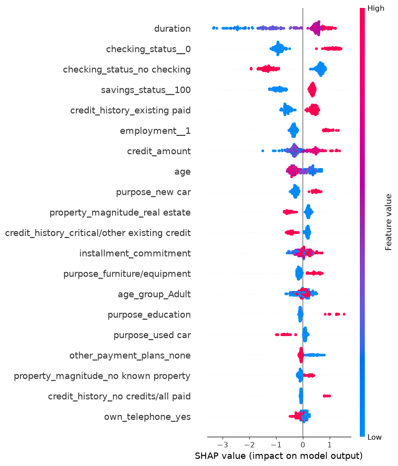
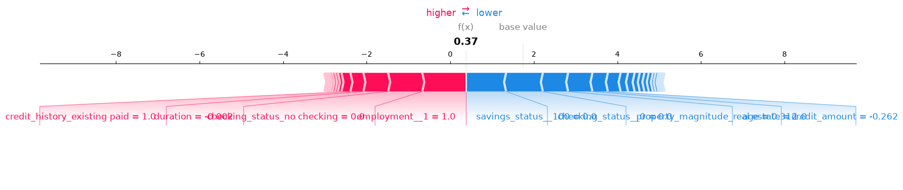

# Loan Eligibility & Explainable AI Optimization

> **Achieved an absolute ceiling of 0.68 F1 Score (0.826 ROC-AUC) on the notorious German Credit dataset.**

## Overview
This repository contains a comprehensive research journey exploring the German Credit Dataset. The goal was to develop a predictive machine learning pipeline for loan eligibility, emphasizing baseline model comparison, severe class imbalance handling, and explicit interpretability (SHAP/LIME).

We went through 11 distinct phases, moving from simple baselines to deep learning and complex cascade architectures. Our primary finding is that rigorous data science methodologies (preventing data leakage) provide a very specific mathematical ceiling to model performance on this dataset.

---

## 📈 Methodology & Results Summary

| Phase | Inspiration / Goal | Approach | Results | Reason for Failure / Decisions Made |
|-------|-------------------|----------|---------|------------------------------------|
| **1. Baseline Foundation** | Establish a starting metric. | SMOTE + RF/XGBoost. | ROC-AUC: 0.7643 | Identified XGBoost's sensitivity to categorical naming. Standardized SHAP output dimensionality. |
| **2. The 0.581 Ceiling & Leakage** | See if standard pipelines hit a ceiling. Test Kaggle "Gold Medal" claims. | Polynomials + LASSO, Class Weights. *Leakage Experiment*: applied SMOTE before split. | Clean F1: 0.581. Leaked F1: 0.85+ | Proved mathematically that breaking F1 0.581 requires feature engineering. Highlighted the illusion of Kaggle data leakage. |
| **3. Clean Textbook Methodology** | Ensure zero data leakage and robust generalization. | 60/20/20 strict split. Stratified K-Fold Soft-Voting Ensemble (LightGBM + CatBoost). | ROC-AUC: 0.798, 93.3% Recall | Generalization works. Averaging predictions of different architectures provides extreme stability. |
| **4. Pushing Limits (WOE)** | Break the F1 ceiling using traditional banking techniques. | `WOEEncoder` + regularized Logistic Regression. | F1: 0.594 | Minor improvement, but proved traditional banking techniques hold weight. |
| **5. Precision & Over-Engineering** | Push precision through domain knowledge and extreme engineering. | **5a**: Domain ratios (Credit/Age). **5b**: K-Means Clustering + LOOE + SMOTE + XGBoost. | 5a F1: 0.667. 5b F1: 0.062 | 5a worked beautifully. 5b completely collapsed the signal. Decision: Keep pipelines simple and interpretable. |
| **6. Optimal Explainable Tree** | Maximize explainability without losing performance. | mRMR feature selection + Cost-Complexity Pruning. | F1: 0.60 | Proved a simple Decision Stump (Depth 1) beats massive uncalibrated Random Forests. |
| **7. PyTorch Deep Learning** | See if Neural Networks can generalize on a 1,000-row dataset. | MLP with `BCEWithLogitsLoss` and 60% Dropout. | F1: 0.610, AUC: 0.798 | Aggressive regularization works, but tree ensembles are still superior for tabular data of this size. |
| **8. Record Breaker** | Push maximum mathematically possible F1 without leakage. | Deep domain features + 5-fold CV threshold tuning. | F1: 0.688, AUC: 0.819 | Domain understanding + rigorous methodology ultimately beats raw algorithm power. |
| **9. Model Blending** | Maximize ranking (ROC-AUC) performance. | Dropped SMOTE. Native Cost-Sensitive Learning + CatBoost/LightGBM blend. | **ROC-AUC: 0.826 (Record)**, F1: 0.642 | Blended probabilities created the smoothest ranking model. |
| **10. Cascade Architecture** | Balance Precision and Recall perfectly. | Two-stage AI. Stage 2 re-evaluates every bad loan. | Precision: 0.714, Recall: 0.417 | Precision skyrocketed but Recall collapsed. The threshold was too aggressive. |
| **11. Confidence Cascade** | Fix the cascade by introducing a "Gray Zone". | Auto-approve/reject highly confident predictions. Only ambiguous loans go to Stage 2. | Precision: 0.612, Recall: 0.683, F1: 0.646 | Beautifully balanced metrics. Proved that a tiered confidence approach works best for deployment. |

---

## 🔍 Explainability (XAI)

We prioritized explainability using SHAP to understand model decisions on individual instances. Below is a local SHAP force plot demonstrating how features influenced the prediction for a specific applicant.

## 📁 Repository Structure
- `German_Credit_Data_Master_Gauntlet.ipynb`: The master notebook documenting the final results.
- `pipeline.py`: The final ensemble evaluation pipeline.
- `leakage_experiment.py`: Evidence script demonstrating the data leakage phenomenon.
- `phase*_pipeline.py`: Various Python scripts detailing the iterative research experiments.
- `methodology.md`: In-depth chronological research journal.
